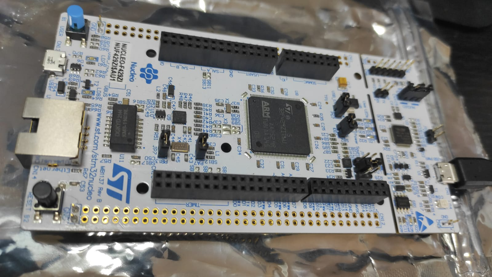

# Build_your_own_RealTime_OS
A guide how to build your own realtime Operating System.  The code samples are applicable on STM32 microcontrollers

## Summary
Source code adapted after the Udemy.com course "Build Your Own RealTime OS (RTOS) From Ground Up™ on ARM 1" , authored by Israel Gbati.
* https://www.udemy.com/course/rtos-building-from-ground-up-on-arm-processors/

The source code is tested on STM32 Nucleo 144 family boards.

https://www.st.com/en/evaluation-tools/nucleo-f429zi.html

### STM32 Nucleo F429ZI

### A repository started by
* George Calin
* george.calin [at] gmail.com
* Connect me on LinkedIn: https://www.linkedin.com/in/cgeorge1978/
